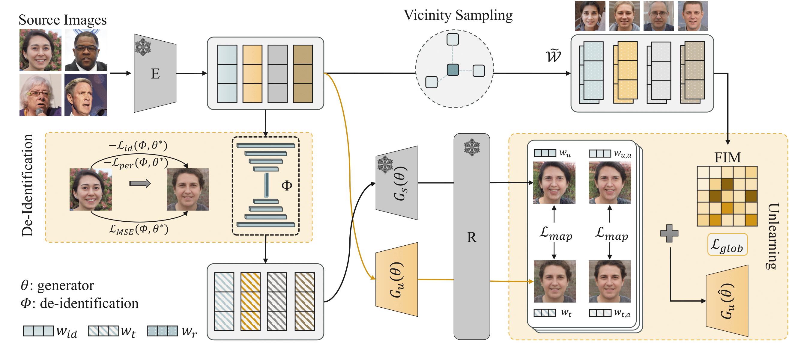
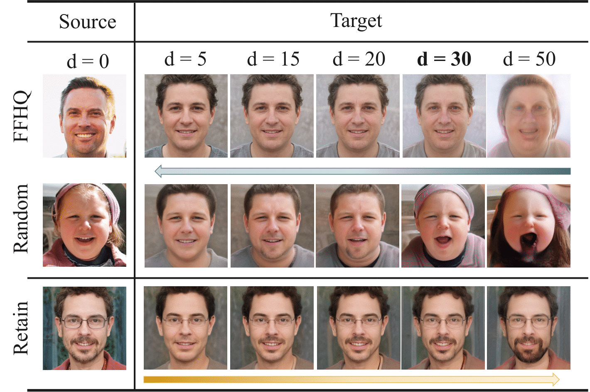

# SUGAR: A Sweeter Spot for Generative Unlearning of Many Identities

*Dung Thuy Nguyen♣, Quang Nguyen♠, Preston K. Robinette♣, Eli Jiang♣, Taylor T. Johnson♣, Kevin Leach♣*
## Overview

Recent advances in 3D-aware generative models have enabled high-fidelity image synthesis of human identities. However, this progress raises urgent questions around
user consent and the ability to remove specific individuals from a model’s output space. We address this by introducing SUGAR, a framework for scalable generative un-
learning that enables the removal of many identities (simultaneously or sequentially) without retraining the entire model. Rather than projecting unwanted identities to unrealistic outputs or relying on static template faces,
SUGAR learns a personalized surrogate latent for each identity, diverting reconstructions to visually coherent alternatives while preserving the model's quality and diversity. We further introduce a continual utility preservation objective that guards against degradation as more identities are forgotten. SUGAR achieves state-of-the-art performance in removing up to 200 identities, while delivering up to a 700% improvement in retention utility compared to existing baselines.

## Pipeline Overview




The above figure illustrates the overall pipeline of SUGAR for generative unlearning.

## Requirements

- Python 3.8+
- CUDA-capable GPU (recommended)
- Conda or Miniconda

## Environment Setup

### 1. Clone the Repository

```bash
git clone https://github.com/judydnguyen/SUGAR-Generative-Unlearn.git
cd SUGAR-Generative-Unlearning
```

### 2. Create Conda Environment

Create and activate the conda environment using the provided `environment.yml`:

```bash
conda env create -f environment.yml
conda activate sugar
```

## Download Checkpoints

The following pretrained model checkpoints are required to run the experiments:

### Required Checkpoints

You can download the checkpoints from our link: https://vanderbilt.box.com/s/s13fx23s5g2kvkqa3vmkorxg8h7g464p.

1. **Pretrained Generator** (`ffhqrebalanced512-128.pkl`)
   - StyleGAN3-based 3D-aware generator for FFHQ dataset
   - Download from: [StyleGAN3 Official Repository](https://github.com/NVlabs/stylegan3) or provided model repository
   - Place in the root directory

2. **Encoder** (`encoder_FFHQ.pt`)
   - GOAE encoder for FFHQ dataset
   - Used for image-to-latent inversion
   - Place in the root directory

3. **Average Latent Code** (`w_avg_ffhqrebalanced512-128.pt`)
   - Precomputed average latent code for the generator
   - Place in the root directory

4. **ArcFace Model** (`model_ir_se50.pth`)
   - IR-SE50 model for identity loss computation
   - Used for face identity preservation
   - Place in the root directory

### Verify Checkpoints

After downloading, verify that all required files are present:

```bash
ls -lh ffhqrebalanced512-128.pkl encoder_FFHQ.pt w_avg_ffhqrebalanced512-128.pt model_ir_se50.pth
```

## Data Preparation

Prepare your data in the following structure:

```
data/
├── exp01/
│   ├── celebahq-forget-5/      # Images to forget (5 identities)
│   │   ├── 000990.jpg
│   │   ├── ...
│   └── celebahq-retain-10/     # Images to retain (10 identities)
│       ├── 000001.jpg
│       └── ...
```

## Usage

### Basic Usage

Run unlearning with default settings:

```bash
python optimized_unlearn.py \
    --exp my_experiment \
    --inversion goae \
    --inversion_image_path unlearn_images_go_here \
    --valid_dir valid_dir_goes_here \
    --local \
    --nei \
    --trigger_epochs 50
```

### Using Pre-configured Scripts

Example scripts are provided in `scripts/celebahq/`:

```bash
# Unlearn 5 identities
bash scripts/celebahq/ours_unlearn_5_ids.sh

# Unlearn 1 identity
bash scripts/celebahq/ours_unlearn_1_id.sh
```

### Key Parameters

- `--exp`: Experiment name (required)
- `--inversion`: Inversion method (default: `goae`)
- `--inversion_image_path`: Path to images to forget
- `--valid_dir`: Path to validation/retain images
- `--trigger_epochs`: Number of epochs for trigger model training
- `--iter`: Number of iterations for generator training
- `--lr`: Learning rate
- `--batch_size`: Batch size
- `--nei`: Enable unlearning neighboring images
- `--lambda`: Enable our preservation loss
- `--glob`: Enable global preservation loss | used for GUIDE baseline only


## Experiment Outputs

Experiments are saved in the `experiments/` directory:

```
experiments/
└── <experiment_name>/
    ├── args.txt              # Experiment arguments
    ├── checkpoints/          # Model checkpoints
    │   ├── generator_*.pkl
    │   └── trigger_model_*.pt
    └── logs/                 # TensorBoard logs
```

### Viewing Results

Launch TensorBoard to visualize training:

```bash
tensorboard --logdir experiments/<experiment_name>/logs
```

## Project Structure

```
.
├── optimized_unlearn.py      # Main unlearning script
├── unlearn_baseline.py        # Baseline unlearning implementation
├── unlearn_utils.py           # Utility functions for unlearning
├── utils/                     # General utilities
│   ├── model_utils.py         # Model loading utilities
│   ├── training_utils.py      # Training utilities
│   └── ...
├── training/                  # Training modules
│   ├── unlearn_training.py   # Unlearning training loop
│   └── ...
├── scripts/                   # Example scripts
│   └── celebahq/
└── data/                      # Data directory
```

## Citation

If you use this code in your research, please cite:

```bibtex
To Be Updated
```

## License

MIT license.

## Acknowledgments

[GUIDE](https://github.com/KU-VGI/GUIDE)

